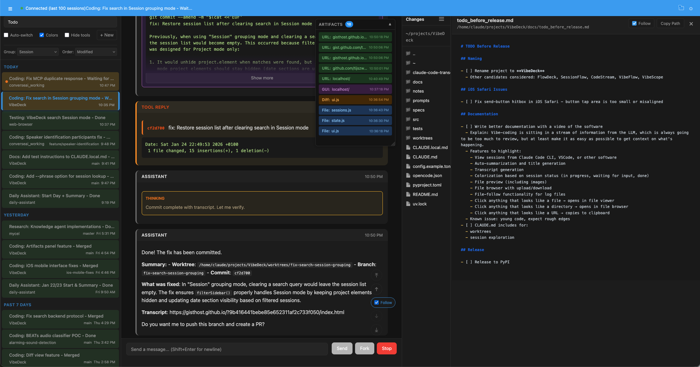

# VibeDeck

Live-updating transcript viewer and web frontend for Claude Code and OpenCode sessions.

## Overview

VibeDeck is a front-end to Claude Code and OpenCode.



Mainly designed to:

- Get an overview on what exactly the LLM did and why, as quickly as possible.
- Keep track of many sessions and tasks running in parallel. Don't lose track as you kick off edits in multiple worktrees and/or projects.

## Features

* Designed to get a quick & complete overview of everything the coding-agent is doing. Keeps a list of changed files. All paths in the session are clickable to immediately open in the file-viewer. URLs are clickable to copy to clipboard.
* Watches the file-system. View sessions that initiated inside VibeDeck, as well as cli, IDE integration, etc. Everything in one place.
* Automatically generate titles and summaries for all Claude Code sessions. Automatically color by 'TODO', 'In Progress', 'Waiting for input' or 'Done'. Automatically detect branch/worktrees.
* full-fledged Claude Code interface in the browser. Run locally or in a remote dev environment.
* Built-in file-browser with Browsing / Upload / Download / Delete file
* File preview: Text / Code / MD / Images / Audio / HTML / Git Diff
* File-tail functionality (follow) for logfiles
* Tooling for generating transcripts of Claude Code sessions, and searching previous sessions.


## Installation

```bash
uv tool install git+https://github.com/tijszwinkels/vibedeck
```

Or run directly:

```bash
uvx git+https://github.com/tijszwinkels/vibedeck
```

## Usage

### Live Viewer (default)

```bash
# Watch all recent sessions (auto-detected, up to 10)
vibedeck

# Watch a specific session file (in addition to auto-discovered ones)
vibedeck --session ~/.claude/projects/.../session.jsonl

# Limit number of sessions
vibedeck --max-sessions 5

# Custom port
vibedeck --port 8765

# Don't auto-open browser
vibedeck --no-open
```

### Export to HTML

Export session transcripts to static HTML files with pagination, search, and statistics:

```bash
# Export Claude Code session to HTML
vibedeck html ~/.claude/projects/.../session.jsonl -o ./output

# Export OpenCode session by ID
vibedeck html ses_xxx -o ./output

# Upload to GitHub Gist with preview URL
vibedeck html session.jsonl --gist

# Open in browser after export
vibedeck html session.jsonl -o ./output --open
```

### Export to Markdown

```bash
# Export to stdout
vibedeck md session.jsonl

# Export to file
vibedeck md session.jsonl -o transcript.md

# Export OpenCode session
vibedeck md ses_xxx -o transcript.md
```

## Features

### Live Viewer
- **Multi-session tabs** - View multiple Claude Code sessions in a tabbed interface
- **Auto-follow** - Automatically switches to the tab with new activity (optional)
- **Live updates** - New messages appear automatically via Server-Sent Events
- **Auto-scroll** - Follows new messages when you're at the bottom
- **Resource-conscious** - Limits DOM nodes to prevent memory issues
- **Session discovery** - Automatically finds recent sessions in ~/.claude/projects/
- **Same styling** - Uses the same CSS as claude-code-transcripts

### Static Export
- **HTML export** - Paginated HTML files with index page, full-text search, and statistics
- **Markdown export** - Single-file Markdown for documentation or archiving
- **Gist upload** - Upload to GitHub Gist with gisthost.github.io preview URL
- **Multi-backend** - Supports both Claude Code (.jsonl) and OpenCode (session IDs)

## Configuration

CLI options can be set in a TOML config file. Use `--config` to load a config file:

```bash
# Load config and start server
vibedeck --config config.toml

# Show effective configuration
vibedeck --config config.toml config
```

CLI arguments override config file values. See `config.example.toml` for all options.

Example config:

```toml
[serve]
port = 9000
host = "0.0.0.0"
no_open = true
max_sessions = 50

[html]
gist = true
repo = "owner/repo"
```

## Development

```bash
# Install dependencies
uv sync

# Run tests
uv run pytest

# Run development server
uv run vibedeck --debug
```

## Credits

This project is based on [claude-code-transcripts](https://github.com/simonw/claude-code-transcripts) by [Simon Willison](https://simonwillison.net/). This project allows to generate html-pages from claude code transcripts, put those in gists, and attach them to commit logs, which is tremendously useful. The HTML rendering, CSS styling, and message formatting are adapted from that project.

This is an adaptation that allows to view the transcripts in a browser while claude is working. It's more readable than the claude code output itself, so I keep this open in a second screen while I'm working, so I can easily keep track of what the coding agent is doing.

## License

Apache 2.0
